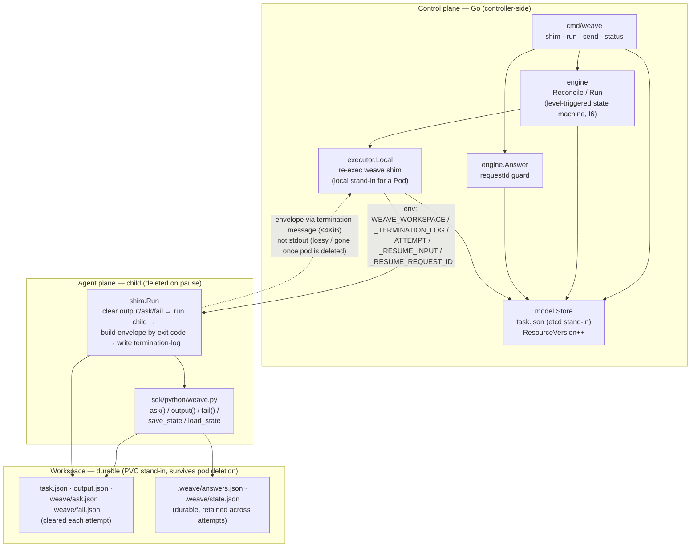
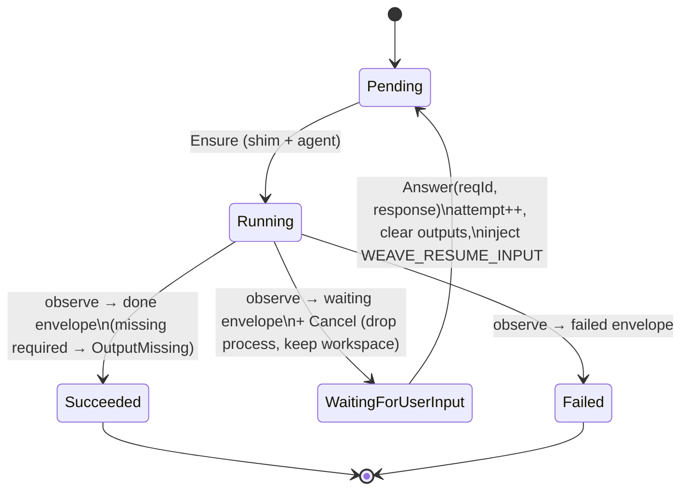
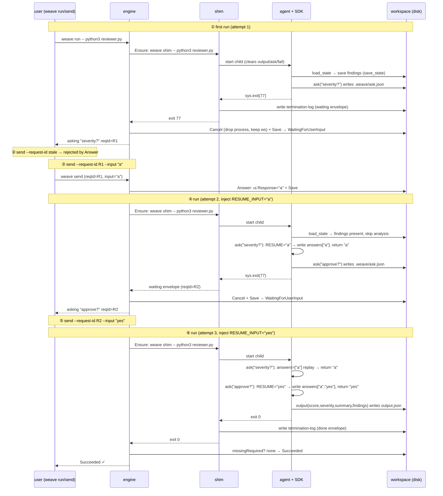
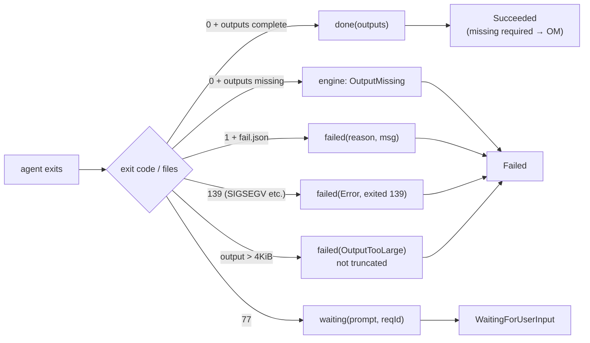

# Weave Architecture & Flow (as-built, v1.1 spike)

> Date: 2026-09-04 · maps to the spike code validated alongside `DESIGN-v1.1.md`.
> This describes the code **as it stands today**, not the target design. Complements `README.md` (overview) and `DESIGN-v1.1.md` (delta vs v1.0).

---

## 0. One sentence

Weave lets an agent **pause mid-execution, ask a human, then continue** — without a real pause/resume runtime. It simulates one with "exit code 77 + on-disk state": the agent exits 77 to mean "I need to ask a human", the shim translates that into an envelope, the control plane tears the process down, and when the human answers it relaunches a **fresh process** that replays from scratch. Designed to run on K3s with zero external dependencies.

---

## 1. At a glance (for someone who hasn't read the code)

- **Three things running**: the control plane (Go), the agent (a child wrapped by the shim), and the workspace (on-disk state, = PVC stand-in).
- **One envelope crosses the boundary**: on exit the shim writes an `envelope` (exactly one of done / waiting / failed) to the termination message (≤4KiB). The control plane parses only this one format. stdout is not a data channel — it's a lossy log plane.
- **Exit code 77 is a signal, not a crash.** The control plane sees 77, deletes the process, keeps the workspace, waits for a human answer, then relaunches a new process with `WEAVE_RESUME_INPUT`. The agent replays from the top; `answers.json` fills back in the questions already answered.
- **Safe to restart at any point** (invariant I6): every state transition is derived from disk alone, and every step is persisted atomically.

---

## 2. Component architecture

**Boundary**: the agent never sees exit 77, request IDs, or the envelope — the shim owns the protocol. A program that just writes `output.json` and exits 0 is a valid Weave agent; **the SDK is optional**.

**Workspace file lifetimes**:

| File | Lifetime | Role |
|---|---|---|
| `task.json` | durable | control-plane state (phase/attempt/userInput/outputs), etcd stand-in |
| `output.json` | cleared each attempt | agent results, Removed by shim on start |
| `.weave/ask.json` | cleared each attempt | current question, Removed by shim on start |
| `.weave/fail.json` | cleared each attempt | failure classification, Removed by shim on start |
| `.weave/answers.json` | **durable** | ordered Q&A log, replay depends on it |
| `.weave/state.json` | **durable** | agent checkpoint, reused across attempts |

---

## 3. State machine (engine.Reconcile advances at most one transition per call)

`engine.Run` is a loop: advance → `Store.Save` (atomic tmp+rename, the local analogue of an etcd transaction) → until `changed==false` or the task is terminal/waiting. The process can die between any two steps; on restart it lands back where it was from `task.json` — that is **I6**.

---

## 4. Core flow: the exit-77 double-ask loop (demo.sh, 6 steps)

Using `examples/reviewer.py` (two questions) to show "exit → replay → the second question is not answered by the first answer".

**The replay mechanism** (`weave.py` `ask()`): read `answers.json` first (if the Nth question was already answered, return the Nth answer), otherwise take `WEAVE_RESUME_INPUT` (the answer to the question that paused us). So "the Nth `ask()` on replay returns the Nth answer" — two questions never cross.

**The cost**: code before `ask()` runs more than once. Pure computation is fine; anything with side effects (requests, external writes) must be guarded with `save_state/load_state` — exactly what `reviewer.py` does for findings.

---

## 5. Failure routing (the shim covers every exit path)

Mapped to `demo.sh` failure samples:

| Sample | agent behavior | exit | shim envelope | engine verdict |
|---|---|---|---|---|
| `nooutput.py` | prints, writes no output | 0 | done(outputs=empty) | `OutputMissing` (never silently blank) |
| `crash.py` | `os.kill(SIGSEGV)` | 139 | failed(Error,"exited 139") | `Failed(Error)` |
| `huge.py` | `output(report="x"*5000)` | 0 | failed(OutputTooLarge) | `Failed(OutputTooLarge)` |
| `transient.py` | `weave.fail("Transient",...)` | 1 | failed(Transient, msg) | `Failed(Transient)` |

**Two guardrail designs**:
- **Never truncate an over-limit envelope** — truncation yields syntactically invalid JSON, the downstream parse error points nowhere near the cause; degrade to `failed(OutputTooLarge)` so the error is attributable.
- **Never trust a stale envelope** — `env.Attempt != t.Spec.Attempt` is `ContractViolation`; a retry never reads the previous attempt's residue.

---

## 6. Three race-safety invariants

| Invariant | Where | What it prevents |
|---|---|---|
| **I6 level-triggered** | `engine.Reconcile` derives from disk only; `Store.Save` after every step | controller crash at any point → restart lands in the same place |
| **requestId on Task.status** | `model.UserInput.RequestID` + `engine.Answer` check | a retried `send` can't answer the wrong (already-advanced) question |
| **outputsAttempt guard** | `OutputsAttempt` vs `Spec.Attempt` | a later attempt never trusts an earlier attempt's outputs |

Bonus: `engine.Answer` has three gates — ① phase must be `WaitingForUserInput`, ② the question is not yet answered, ③ `requestId` matches (or is empty). Any failure reports "what is currently being asked".

---

## 7. Package & file index

| Path | Role |
|---|---|
| `cmd/weave/main.go` | CLI router: `shim` / `run` / `send` / `status` |
| `internal/engine/engine.go` | reconcile state machine + `Answer` + `Run` |
| `internal/executor/executor.go` | `Executor` interface, `Capabilities`, `ExecSpec` (deliberately K8s-type-free) |
| `internal/executor/local.go` | local synchronous impl: re-exec `weave shim`, write `result.json` |
| `internal/shim/shim.go` | entrypoint wrapper: clear scratch, forward signals, build envelope by exit code |
| `internal/envelope/envelope.go` | envelope format: `Kind/Reason`, `Marshal` (4KiB budget), `Parse/Validate` |
| `internal/model/task.go` | `Task/TaskSpec/TaskStatus` + file-backed `Store` (etcd stand-in) |
| `sdk/python/weave.py` | agent SDK: `ask/output/fail/load_state/save_state` |
| `examples/reviewer.py` | two-question reviewer, demonstrates save_state skipping side effects |
| `demo.sh` | end-to-end exit-77 loop + four failure samples |
